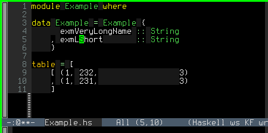

## keep-formation Emacs minor mode

This is rough and initial implemetation of a minor mode to make editing in Emacs be
aware of space tabulation.

Space tabulation uses space characters exclusively in order to align tokens in the code.

Normally when editing, insertion or deletion of text does not take the tabulation into
account, and alignment breaks, forcing the user to either reuse `align-string` or
to manually fix the whitespace. This minor mode comes to prevent the form-breaking of
existing tabulation alignment.
